# WitsV3 File Structure Documentation

This document provides a comprehensive overview of the WitsV3 project structure, describing the purpose and organization of directories and key files.

## Table of Contents

- [1. Project Overview](#1-project-overview)
- [2. Root Directory](#2-root-directory)
- [3. Core Packages](#3-core-packages)
  - [3.1. Core Package](#31-core-package)
  - [3.2. Agents Package](#32-agents-package)
  - [3.3. Tools Package](#33-tools-package)
- [4. Configuration](#4-configuration)
- [5. Documentation](#5-documentation)
- [6. Testing](#6-testing)
- [7. Auxiliary Components](#7-auxiliary-components)
- [8. GUI Components](#8-gui-components)
- [9. MCP Integration](#9-mcp-integration)
- [10. File Organization Conventions](#10-file-organization-conventions)
- [11. Visual Structure Overview](#11-visual-structure-overview)

## 1. Project Overview

WitsV3 is an LLM orchestration system with a CLI-first approach, implementing the ReAct pattern and offering a modular tool registry. The codebase follows a structured organization with three main packages:

- `core/`: Core functionality (config, LLM interface, memory, schemas)
- `agents/`: Agent implementations (BaseAgent, Orchestrators, Control Center)
- `tools/`: Tool implementations extending BaseTool

The system supports both synchronous and asynchronous operations, with a strong emphasis on async patterns for optimal performance.

## 2. Root Directory

The root directory contains:

- **Main Python files**:

  - `run.py`: Main CLI entry point
  - `run_background_agent.py`: Background agent execution
  - `test_witsv3.py`: Non-interactive test runner
  - `install.py`: Installation script
  - `setup.py`: Package setup configuration

- **Configuration files**:

  - `config.yaml`: Main configuration
  - `pyproject.toml`: Python project settings
  - `pytest.ini`: Testing configuration
  - `mypy.ini`: Type checking settings
  - `requirements.txt`: Production dependencies
  - `requirements-dev.txt`: Development dependencies
  - `Makefile`: Build/test automation

- **Documentation files**:

  - `README.md`: Main project documentation
  - `LICENSE`: MIT license

- **Package definition**:
  - `__init__.py`: Package metadata and exports
  - `MANIFEST.in`: Package inclusion rules

## 3. Core Packages

### 3.1. Core Package (`core/`)

Contains the fundamental components of the WitsV3 system:

- **LLM Interface**:

  - `llm_interface.py`: Base class and implementations for LLM providers
  - `adaptive/`: Adaptive LLM system components for dynamic model routing

- **Memory Management**:

  - `memory_manager.py`: Memory persistence and retrieval
  - `neural_memory_backend.py`: Neural network-based memory implementation
  - `neural_web_core.py`: Graph-based neural network for knowledge representation

- **Configuration**:

  - `config.py`: Configuration system with Pydantic models
  - `adaptive_llm_config.py`: Configuration for adaptive LLM system

- **Tool System**:

  - `base_tool.py`: Base class for all tools
  - `tool_registry.py`: Dynamic tool registration and discovery
  - `mcp_adapter.py`: Model Context Protocol integration

- **Response Handling**:

  - `response_parser.py`: Parsing LLM responses in various formats
  - `schemas.py`: Data models for system communication

- **System Components**:
  - `metrics.py`: Performance tracking and metrics collection
  - `file_watcher.py`: File change detection for auto-restart
  - `personality_manager.py`: Personality and ethics management

### 3.2. Agents Package (`agents/`)

Contains agent implementations that orchestrate system behavior:

- `base_agent.py`: Abstract base class for all agents
- `base_orchestrator_agent.py`: Base class for orchestrator agents
- `wits_control_center_agent.py`: Main entry point for processing user requests
- `llm_driven_orchestrator.py`: ReAct pattern implementation
- `background_agent.py`: Scheduled tasks and system maintenance
- `neural_orchestrator_agent.py`: Neural-enhanced decision making
- `advanced_coding_agent.py`: Code generation and analysis
- `book_writing_agent.py`: Specialized for book writing tasks
- `self_repair_agent.py`: System monitoring and self-maintenance

### 3.3. Tools Package (`tools/`)

Contains implementations of system tools:

- `file_tools.py`: File operations (read, write, list)
- `intent_analysis_tool.py`: User intent analysis
- `conversation_history_tool.py`: Conversation context tools
- `math_tool.py`: Mathematical operations
- `python_execution_tool.py`: Secure Python code execution
- `json_tool.py`: JSON manipulation
- `web_search_tool.py`: Internet search capability
- `mcp_tool_registry.py`: MCP tool integration

## 4. Configuration (`config/`)

Contains configuration files and templates:

- `config.yaml`: Main configuration file
- `wits_personality.yaml`: Personality profile settings
- Templates and examples for various configurations

## 5. Documentation (`planning/`)

Contains comprehensive documentation organized by type:

- `architecture/`: System architecture and design documents

  - `system-architecture.md`: Complete system architecture overview

- `implementation/`: Implementation details and summaries

  - `personality-ethics-network-implementation.md`: Personality system
  - `adaptive-llm-design.md`: Adaptive LLM design details

- `roadmap/`: Future plans and enhancement roadmaps

  - `neural-web-roadmap.md`: Neural web architecture plans

- `tasks/`: Task tracking and management

  - `task-management.md`: Current tasks and backlog

- `technical-notes/`: Debug information, fixes, and technical notes

  - `consolidated-system-fixes.md`: All system fixes and improvements

- `archive/`: Archive of original documentation files

## 6. Testing (`tests/`)

Contains test files mirroring the main package structure:

- `tests/core/`: Tests for core components

  - `test_llm_interface.py`: LLM interface tests
  - `test_config.py`: Configuration system tests
  - `test_supabase_backend.py`: Supabase backend tests

- `tests/agents/`: Tests for agent implementations

  - `test_background_agent.py`: Background agent tests

- `tests/tools/`: Tests for tools

  - `test_json_tool.py`: JSON tool tests
  - `test_math_tool.py`: Math tool tests
  - `test_python_execution_tool.py`: Python execution tool tests
  - `test_web_search_tool.py`: Web search tool tests

- `conftest.py`: Common test fixtures and utilities

## 7. Auxiliary Components

- `data/`: Runtime data storage

  - Contains memory files, neural web data, and configuration
  - Most files auto-generated and excluded from git

- `logs/`: Log files directory

  - Application logs stored here
  - Debug information and error tracking

- `cache/`: Caching directory

  - Semantic cache for adaptive LLM
  - Embedding cache

- `scripts/`: Utility scripts
  - `doc_maintenance.py`: Documentation maintenance tools
  - Various utility and maintenance scripts

## 8. GUI Components (`gui/`)

Contains GUI implementations:

- `book_writing_gui/`: Book writing interface
  - `api/`: Backend API endpoints
  - `models/`: Data models
  - `static/`: CSS, JS, and static assets
  - `templates/`: HTML templates
  - `services/`: Business logic

## 9. MCP Integration (`mcp_servers/`)

Contains Model Context Protocol server implementations:

- `Ollama-mcp/`: Ollama MCP server
- `supabase-mcp/`: Supabase MCP server
- `servers/`: Various MCP servers
  - `filesystem/`: Filesystem operations
  - `git/`: Git operations
  - `memory/`: Memory operations
  - `time/`: DateTime operations

## 10. File Organization Conventions

WitsV3 follows these file organization principles:

- **Package Structure**: Each major component has its own package with `__init__.py`
- **Imports**: Relative imports within packages, absolute for cross-package
- **Module Size**: Files are limited to 500 lines, split when approaching limit
- **Documentation**: README.md files in each major directory
- **Testing**: Tests mirror the package structure in the `tests/` directory
- **Init Files**: Export public classes and functions in `__init__.py`

### Package Patterns

Each package follows a consistent pattern:

```
package_name/
├── __init__.py           # Exports and version
├── module1.py            # Core functionality
├── module2.py            # Additional functionality
├── sub_package/          # Subpackage for related functionality
│   ├── __init__.py       # Subpackage exports
│   └── module.py         # Subpackage implementation
└── README.md             # Package documentation
```

### Naming Conventions

- **Files**: Snake case (`file_name.py`)
- **Classes**: Pascal case (`ClassName`)
- **Functions/Methods**: Snake case (`function_name()`)
- **Constants**: Upper snake case (`CONSTANT_NAME`)
- **Private members**: Prefixed with underscore (`_private_method()`)

### Import Order

1. Standard library imports
2. Third-party imports
3. Application-specific imports
4. Relative imports

## 11. Visual Structure Overview

The following diagram provides a visual representation of the WitsV3 project structure:

```mermaid
graph TD
    Root["WitsV3/"] --> Core["core/"]
    Root --> Agents["agents/"]
    Root --> Tools["tools/"]
    Root --> Tests["tests/"]
    Root --> Planning["planning/"]
    Root --> Scripts["scripts/"]
    Root --> Docs["docs/"]
    Root --> Data["data/"]
    Root --> Config["config/"]
    Root --> Logs["logs/"]
    Root --> Cache["cache/"]
    Root --> GUI["gui/"]
    Root --> MCP["mcp_servers/"]

    Core --> CoreAdaptive["adaptive/"]
    Core --> CoreFiles["llm_interface.py<br/>memory_manager.py<br/>config.py<br/>schemas.py<br/>etc."]

    Agents --> AgentFiles["base_agent.py<br/>wits_control_center_agent.py<br/>llm_driven_orchestrator.py<br/>background_agent.py<br/>etc."]

    Tools --> ToolFiles["file_tools.py<br/>math_tool.py<br/>json_tool.py<br/>web_search_tool.py<br/>etc."]

    Tests --> TestCore["core/"]
    Tests --> TestAgents["agents/"]
    Tests --> TestTools["tools/"]

    Planning --> PlanningArch["architecture/"]
    Planning --> PlanningImpl["implementation/"]
    Planning --> PlanningRoadmap["roadmap/"]
    Planning --> PlanningTasks["tasks/"]
    Planning --> PlanningTech["technical-notes/"]
    Planning --> PlanningArchive["archive/"]

    MCP --> MCPOllama["Ollama-mcp/"]
    MCP --> MCPSupabase["supabase-mcp/"]
    MCP --> MCPServers["servers/"]

    GUI --> GUIBooks["book_writing_gui/"]

    Root --> RootFiles["run.py<br/>config.yaml<br/>README.md<br/>FILE_STRUCTURE.md<br/>TASK.md<br/>PATH_MIGRATION_GUIDE.md<br/>etc."]
```



This documentation should be kept updated as the project structure evolves.
