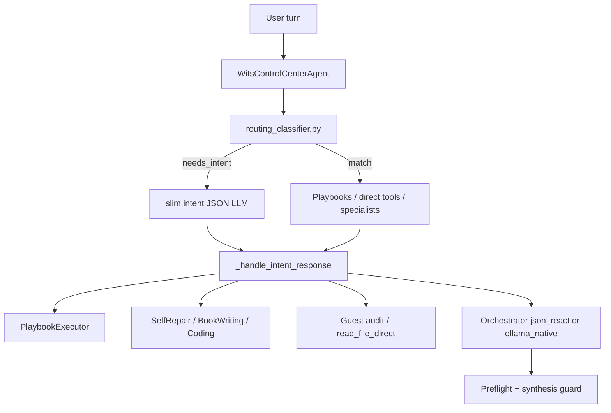

# Conversation & Task Processing Pipeline

**Last updated:** July 9, 2026  
**Status:** Incremental modernization — ReAct remains fallback; route more / react less.

## Architecture (three layers)



| Layer | Components | Role |
|-------|------------|------|
| **1. Deterministic routing** | `agents/routing_classifier.py` | Zero-LLM routing for save, codebase, math, docs, self-repair, playbooks |
| **2. Specialist handoff** | `agents/*_agent.py` | Domain workflows without generic tool loop |
| **3. Orchestrator fallback** | `LLMDrivenOrchestrator` or `NativeToolOrchestrator` | Open-ended tool work with guardrails |

## Intent LLM short-circuit

`WCCAIntentMixin._analyze_user_intent()` calls `classify_message()` first. When `RouteDecision.to_intent()` returns a dict (any destination except `needs_intent`), the slim intent JSON LLM is **not** invoked. Only ambiguous turns pay the intent-LLM cost.

## Owner vs guest routing

| Signal / need | Owner | Guest |
|---------------|-------|-------|
| Greeting / thanks | Direct reply | Direct reply |
| Save / export chat | `save_conversation` playbook | Orchestrator (no specialist) |
| Codebase overview | `codebase_tour` playbook | Orchestrator (no file bootstrap shortcuts) |
| Document Q&A (ingested) | `doc_qa` playbook | Orchestrator if inventory present |
| Self-repair / coding / book | Specialist agents | **Blocked** — orchestrator only |
| Guest chat history / profiles | Direct owner tools | N/A |
| Explicit file read | `read_file_direct` | Blocked |
| Math / web / open tools | Orchestrator (+ calculator short-circuit) | Orchestrator (subset) |
| Ambiguous follow-up | Intent LLM or clarification merge | Same, role-filtered tools |

Order of evaluation: see `classify_message()` in `agents/routing_classifier.py`.

## Decisions (July 2026)

1. **Route more, React less** — Expand deterministic routing and SKILL-style playbooks (`config/playbooks/`) so fewer turns enter the 15-iteration JSON ReAct loop.
2. **Keep JSON ReAct as fallback** — Synthesis guard and preflight are load-bearing for local models (`qwen3:8b`). Default is `ollama_native` after July 9 A/B gate; set `tool_calling_mode: json_react` to rollback.
3. **Pilot native Ollama tool calling** — Opt-in via `orchestrator.tool_calling_mode: ollama_native` in `config.yaml`.
4. **Externalize prompt rules** — `config/orchestrator_prompt.yaml` for tunable orchestrator behavior without code edits.

## Per-turn LLM budget targets

| Turn type | Target LLM calls | Path |
|-----------|------------------|------|
| Greeting / thanks | 1 | Direct reply |
| Remember fact | 0–1 | Early memory store |
| Save conversation | 0 | `save_conversation` playbook |
| Pure math | 0–1 | Calculator short-circuit |
| Codebase intro | 0–1 | `codebase_tour` playbook (orchestrator bootstrap is fallback only) |
| Open-ended tools | ≤ 6 | Orchestrator (ReAct or native) |

## When to use what

| Need | Route |
|------|-------|
| Save/export chat | Playbook `save_conversation` |
| Codebase overview | Playbook `codebase_tour` |
| Document Q&A (ingested files) | Playbook `doc_qa` |
| Fix bugs / run tests | `SelfRepairAgent` |
| New code / scaffolds | `AdvancedCodingAgent` |
| Stories / long-form | `BookWritingAgent` |
| Ambiguous tool work | Orchestrator fallback |

## Configuration

```yaml
orchestrator:
  tool_calling_mode: ollama_native   # default after A/B gate; use json_react to rollback
  prompt_rules_path: config/orchestrator_prompt.yaml
  history_turns: 5
  observation_window: 5
  document_inventory_limit: 5000
```

## Smoke testing

```bash
pytest tests/integration/test_smoke_scenarios_mock.py -q --no-cov
python scripts/conversation_task_smoke.py --quick
python scripts/conversation_task_smoke.py --live --metrics   # requires Ollama
python scripts/conversation_task_smoke.py --live --only perf-sqrt,perf-save,perf-codebase --metrics
python scripts/smoke_ab_compare.py --report json               # json_react vs ollama_native
```

Set `WITS_SMOKE_METRICS=1` (or `--metrics`) to collect `llm_calls`, `react_iterations`, and `wall_ms` per scenario. Performance tier scenarios enforce budget caps.

Scenarios: `scripts/smoke_scenarios.yaml`  
Harness: `scripts/smoke_harness.py`

## Non-goals

- Multi-agent swarm / debate
- Rip-and-replace of routing classifier
- Neural web as default orchestrator path
- GraphRAG (Phase 3b) unless compliance-style doc workflows become primary
