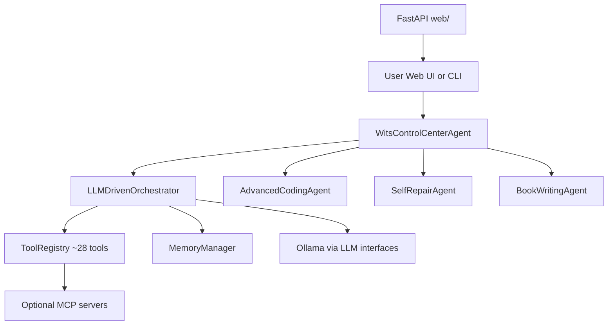

# WitsV3 System Architecture

> **Component map only.** For install/run instructions and shipped features, see
> [`README.md`](../../README.md). For forward work, see
> [`docs/roadmap/suggested-features-2026-07.md`](../roadmap/suggested-features-2026-07.md).
> For memory specifically, see [`memory.md`](memory.md).

## High-level flow

## Packages

| Package | Role |
|---------|------|
| [`agents/`](../../agents/) | Entry routing (WCCA), ReAct orchestrator, specialists |
| [`core/`](../../core/) | Config, LLM, memory backends, safe code editor, schemas |
| [`tools/`](../../tools/) | Auto-discovered `BaseTool` implementations |
| [`web/`](../../web/) | FastAPI + SSE + static PWA (chat, settings, MCP, memory browser) |
| [`config/`](../../config/) | Sidecar YAML (personality, guest policy, background agent) |
| [`var/`](../../var/) | Runtime data (gitignored): memory, sessions, logs, documents |

## Key subsystems

| Subsystem | Primary modules |
|-----------|-----------------|
| **Routing** | `agents/wits_control_center_agent.py`, `agents/wcca_*_mixin.py`, `core/model_router.py` |
| **ReAct loop** | `agents/llm_driven_orchestrator.py`, `agents/orchestrator_tool_helpers.py`, `orchestrator_preflight.py`, `orchestrator_codebase.py` |
| **Verified edits** | `core/safe_code_editor.py` — shared by coding + self-repair agents |
| **Document RAG** | `core/document_hybrid_search.py`, `tools/document_tools.py` |
| **Auth** | Owner bearer token + guest `/join` (`core/guest_access.py`, `web/server.py`) |
| **MCP** | `web/routes_mcp.py`, `core/enhanced_mcp_adapter.py`, `tools/mcp_tool.py` |
| **Memory** | `core/memory_manager.py`, backends in `core/*_memory_backend.py` — see [`memory.md`](memory.md) |

## Agent hierarchy

All agents extend `BaseAgent` and stream `StreamData` (`core/schemas.py`).

- **WitsControlCenterAgent** — parses intent, routes to specialists before generic orchestration
- **LLMDrivenOrchestrator** — tool calling + synthesis guard + JSON repair for local models
- **AdvancedCodingAgent** — scaffolds + verified file edits
- **SelfRepairAgent** — log/test diagnosis → verified fixes
- **BookWritingAgent** — long-form content (not the verified-edit path)
- **BackgroundAgent** — optional Docker scheduled maintenance (local use prefers in-process cron in `run.py` / `run_web.py`)

## Research-only (not default)

These modules exist for experimentation; they are **not** on the default hot path:

- **Neural web** — `memory_manager.backend: neural`; `neural_web*` tools register only when that backend is active
- **Knowledge graph** — `core/knowledge_graph.py` (not wired to document RAG)
- **Working memory** — `core/working_memory.py` (in-process tests/archive)

See [`memory.md`](memory.md) and [`clutter-catalog-2026-07.md`](../roadmap/clutter-catalog-2026-07.md) Wave D.

## External dependencies

- **Ollama** (primary LLM + embeddings) — `http://localhost:11434`
- **Optional:** Tavily/Brave keys for web search; `ANTHROPIC_API_KEY` for ask-Claude escalation; Supabase for cloud memory (parked)

## Historical material

Mid-2025 implementation plans, adaptive-LLM design, and debug dumps live under
[`docs/archive/`](../archive/), [`docs/implementation/`](../implementation/), and
[`docs/technical-notes/`](../technical-notes/) — **do not use for current product status**.
