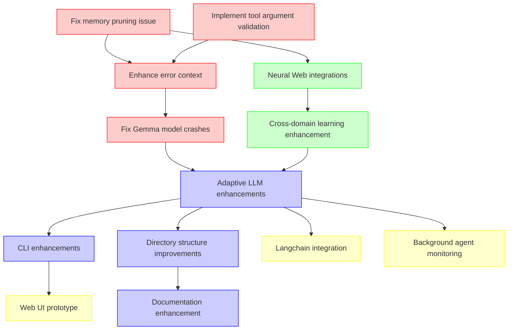

# Backlog Clearance Master Plan

This document serves as the central coordination point for the WitsV3 backlog clearance effort. It provides a comprehensive overview of the implementation strategy, task prioritization, dependencies, and tracking mechanisms.

## Overview

The WitsV3 backlog has been organized into four phases, each with a specific focus and timeline:

1. **Phase 1: Critical Fixes** (June 12-15, 2025)
2. **Phase 2: Complete Neural Web** (June 15-23, 2025)
3. **Phase 3: Core Enhancements** (June 20-26, 2025)
4. **Phase 4: New Features** (June 26-July 9, 2025)

Detailed implementation plans have been created for each phase:
- [Phase 1 Implementation Plan](backlog-clearance-phase1.md)
- [Phase 2 Implementation Plan](backlog-clearance-phase2.md)
- [Phase 3 Implementation Plan](backlog-clearance-phase3.md)
- [Phase 4 Implementation Plan](backlog-clearance-phase4.md)

## Task Prioritization and Dependencies

### Critical Path Analysis

The following tasks form the critical path for the backlog clearance:

1. **Phase 1: Fix memory pruning issue** - This is a foundational fix that affects system stability
2. **Phase 1: Implement tool argument validation** - Required for robust tool execution
3. **Phase 2: Complete Neural Web integrations** - Builds on the cross-domain learning implementation
4. **Phase 3: Adaptive LLM enhancements** - Core system improvement that affects all interactions
5. **Phase 4: Web UI prototype** - Depends on stable core components from previous phases

### Dependencies Map

## Implementation Strategy

### Phase 1: Critical Fixes (June 12-15, 2025)

**Priority Order:**
1. Fix memory pruning issue
2. Implement tool argument validation
3. Enhance error context in streaming responses
4. Fix Gemma model crashes

**Strategy:**
- Focus on one task at a time to ensure stability
- Implement comprehensive tests for each fix
- Document all changes in code comments and update relevant documentation
- Daily check-ins to verify fixes don't introduce new issues

### Phase 2: Complete Neural Web (June 15-23, 2025)

**Priority Order:**
1. Complete Neural Web integrations
2. Implement domain-specific reasoning patterns
3. Add visualization tools for knowledge networks
4. Create benchmarks for knowledge transfer effectiveness
5. Add specialized NLP tools for concept extraction

**Strategy:**
- Build on the cross-domain learning implementation completed on June 11
- Implement visualization tools early to help debug and understand the Neural Web
- Focus on measurable benchmarks to validate effectiveness
- Ensure backward compatibility with existing agents

### Phase 3: Core Enhancements (June 20-26, 2025)

**Priority Order:**
1. Create specialized module training pipeline
2. Implement advanced domain classification
3. Add user pattern learning
4. Optimize module switching for performance
5. Add rich/colorama for better CLI formatting
6. Implement command history and session management
7. Consolidate directory structure
8. Enhance documentation

**Strategy:**
- Begin with Adaptive LLM enhancements as they form the core of the system
- Implement CLI improvements in parallel with other tasks
- Use directory structure improvements as an opportunity to clean up technical debt
- Document all changes thoroughly to support future development

### Phase 4: New Features (June 26-July 9, 2025)

**Priority Order:**
1. Create FastAPI backend for Web UI
2. Implement basic React frontend
3. Create Langchain bridge
4. Support Langchain tools
5. Implement background agent monitoring dashboard
6. Add alert system for resource thresholds

**Strategy:**
- Begin with the Web UI prototype as it provides the most user-facing value
- Implement Langchain integration in parallel with the Web UI
- Add monitoring capabilities last, as they depend on stable core components
- Focus on creating a minimum viable product for each feature

## Resource Allocation

### Team Structure

For optimal execution, the following team structure is recommended:

1. **Core Team** (3-4 developers)
   - Focus on critical fixes and core enhancements
   - Responsible for Phases 1 and 3

2. **Neural Web Team** (2-3 developers)
   - Focus on Neural Web completion
   - Responsible for Phase 2

3. **Features Team** (2-3 developers)
   - Focus on new features
   - Responsible for Phase 4

4. **QA/Testing** (1-2 testers)
   - Support all teams with testing
   - Focus on regression testing and stability

### Time Allocation

The following time allocation is recommended for each phase:

| Phase | Duration | Developer Days | Focus Areas |
|-------|----------|----------------|-------------|
| Phase 1 | 4 days | 12-16 | Critical fixes, stability |
| Phase 2 | 8 days | 16-24 | Neural Web, knowledge representation |
| Phase 3 | 7 days | 21-28 | Core enhancements, performance |
| Phase 4 | 14 days | 28-42 | New features, user experience |

## Progress Tracking

### Task Status Tracking

Progress will be tracked in the root TASK.md file, with the following status indicators:

- [ ] Task not started
- [x] Task completed
- [~] Task in progress
- [!] Task blocked

### Daily Updates

Daily updates will be added to this document in the "Progress Log" section below, including:

- Tasks completed
- Tasks started
- Blockers encountered
- Changes to the plan

### Metrics

The following metrics will be tracked to measure progress:

1. **Task Completion Rate**: Number of tasks completed vs. planned
2. **Test Pass Rate**: Percentage of tests passing
3. **Code Quality**: Linting and static analysis results
4. **Documentation Coverage**: Percentage of code with proper documentation

## Risk Management

| Risk | Probability | Impact | Mitigation |
|------|------------|--------|------------|
| Critical fixes introduce new bugs | Medium | High | Comprehensive testing, code reviews |
| Neural Web integration more complex than estimated | High | Medium | Start with simpler components, incremental approach |
| Resource constraints delay implementation | Medium | Medium | Prioritize critical path tasks, adjust scope if needed |
| Dependencies between phases cause cascading delays | Medium | High | Regular cross-team coordination, buffer time between phases |
| Technical debt slows down implementation | High | Medium | Allocate time for refactoring, focus on clean code |

## Progress Log

### 2025-06-11
- Created comprehensive backlog clearance plan
- Developed detailed implementation plans for all four phases
- Identified critical path and dependencies
- Established progress tracking mechanism

## Next Steps

1. Begin implementation of Phase 1 tasks on June 12, 2025
2. Daily check-ins to track progress and address blockers
3. Weekly review of the overall plan to make adjustments as needed
4. Prepare for Phase 2 kickoff on June 15, 2025

## Conclusion

This master plan provides a comprehensive approach to clearing the WitsV3 backlog in a structured and efficient manner. By following this plan, the team will be able to address critical issues, complete core functionality, and add valuable new features while maintaining system stability and code quality.

The phased approach allows for incremental improvements and regular validation of progress, ensuring that the most important tasks are completed first and that dependencies are properly managed.

Regular updates to this document will provide visibility into progress and allow for adjustments as needed to ensure successful completion of the backlog clearance effort.
