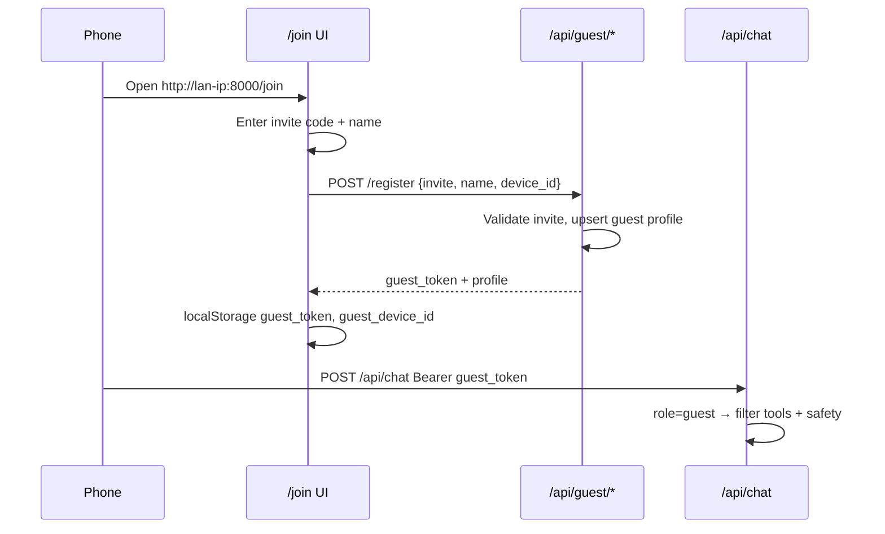

# Guest / family tester access

**Created:** July 8, 2026  
**Last reviewed:** July 8, 2026 (plan review + safe-MVP merge)  
**Status:** Safe MVP implemented (Phase 1+2); Phase 3 content policy partial; guest audit logging shipped; Phase 4 owner admin UI still open  
**Priority:** P1 (user-requested)  
**Branch target:** `cursor/work` → `fix/revive-2026-07`

Let a trusted family member (e.g. nephew on the same WiFi) use Wits from a phone
**without the owner token**, with age-appropriate guardrails and a remembered
identity per device.

---

## Plan review (July 8)

The original design is **appropriate** for a LAN family tester. Changes before build:

| Finding | Change |
|---------|--------|
| Phase 1 chat-only without tool locks is unsafe | **Merge Phase 1+2** into a “safe MVP”: guest cannot chat until tool allowlist + owner-only routes ship |
| `/api/guest/register` must bypass owner Bearer | Explicit **public guest endpoints**; middleware allows them when guest access is enabled |
| Short invite as HMAC key is weak | Separate **`WITSV3_GUEST_SECRET`** (or derive from owner web token + invite) for signing guest JWTs |
| `guest_access.enabled: true` by default | Default **`false`** until invite + secret are set |
| Guest could type `/shutdown` in chat | Owner slash commands require **owner Bearer**, not guest token |
| `evaluate_ethics()` as primary filter | Keep as optional; **hard allowlist + content policy** are the real controls |
| Specialist agents (coding / self-repair) | Guests must **not** route to those agents — WCCA guest path = chat/orchestrator with filtered tools only |
| **LAN URL / QR embedded owner token** | **Fixed July 8:** phone banner uses `/join` only; `?owner_token=` localhost-only; stale LAN owner tokens cleared when guest mode on |
| Open questions (no owner answer yet) | Defaults for MVP: **teen** policy, **no document RAG**, **text invite**, **in-memory sessions OK** |

---

## Requirements (mapped)

| ID | Requirement | Notes |
|----|-------------|-------|
| **A** | Connect from phone on LAN | Mostly shipped: `0.0.0.0:8000`, PWA shell, LAN URL in startup banner |
| **B1** | Web UI for non-owner users | Today every `/api/*` call needs `WITSV3_WEB_TOKEN`; static HTML loads but chat is blocked |
| **B2** | Ethics & protections | Prompt-only ethics today; `evaluate_ethics()` exists but is never called; guest must not reach destructive tools or adult content |
| **C1** | Introduce themselves | First-visit onboarding: name (+ optional age band) |
| **C2** | Remember who they are | Persist identity keyed to device/browser; greet on return |

---

## Current state (baseline)

- **Auth:** Single shared secret (`WITSV3_WEB_TOKEN`) → full API access. No RBAC.
- **LAN:** `run_web.py` binds `0.0.0.0`, prints `http://<lan-ip>:8000/?token=…` for one-tap owner login.
- **Sessions:** In-memory `session_histories` keyed by `session_id`; client stores `wits_session` in `localStorage`. Not tied to user identity.
- **Safety:** Orchestrator preflight blocks some tool loops; Python sandbox off by default; web search `safesearch: moderate`; owner-only shutdown/restart; ask-Claude requires UI approval.
- **Gaps for guests:** No guest token path, no tool allowlist by role, no content gate, no device registry, owner pages (settings/MCP/memory/documents) equally reachable once token is known.

---

## Proposed design

### Roles

| Role | How they authenticate | Capabilities |
|------|----------------------|--------------|
| **Owner** | `WITSV3_WEB_TOKEN` (Bearer / magic link) | Full UI + all tools + settings/MCP/memory/owner controls |
| **Guest** | Device-bound guest session (see below) | Chat-only UI, safe tool subset, isolated memory/session namespace |

Owner token is **never** shared with guests. Guests use a separate **invite code**
(`WITSV3_GUEST_INVITE` in `.env`, rotatable from owner settings).

### Guest auth flow



1. **Device id:** Client generates `guest_device_id` (UUID) on first visit, stored in `localStorage`.
2. **Registration:** `POST /api/guest/register` with `{ invite_code, display_name, device_id }`.
3. **Guest token:** Server returns a signed session token (HMAC or JWT) containing `role=guest`, `device_id`, `guest_id`. Stored as `localStorage.wits_guest_token`.
4. **Return visit:** Client sends token; server validates expiry; if valid, skip intro (or show “Welcome back, {name}”).
5. **Middleware:** `/api/*` accepts **either** owner Bearer **or** valid guest token. Routes declare `owner_only`.

### Identity storage

File-backed registry (local-first, no new deps):

```
data/guest_profiles.json   # guest_id, display_name, device_ids[], first_seen, last_seen, revoked
data/guest_sessions/       # optional: persisted chat exports per guest (future)
```

In-memory guest chat still uses `session_histories`, but keyed as `guest:{guest_id}:{session_id}` so owner and guest transcripts do not mix.

### UI surfaces

| Page | Owner | Guest |
|------|-------|-------|
| `/` chat | ✅ full sidebar | ✅ chat only (hide docs/memory/settings links) |
| `/join` | redirect if owner token present | onboarding |
| `/settings`, `/mcp`, `/personality` | ✅ | ❌ 403 or hidden |
| Token modal | owner token | replaced by join flow |

Owner settings add **Guest access** panel: enable/disable, show/regenerate invite code, list known guests, revoke device.

### LAN connect (requirement A)

No code change required for binding. Operational checklist:

1. Confirm Windows firewall rule for TCP 8000 (already documented in revival notes).
2. Nephew opens `http://<your-lan-ip>:8000/join` (QR in owner startup banner optional follow-up).
3. Optional hardening: `web_ui.guest_allow_lan_only: true` — reject guest register from non-RFC1918 IPs.

---

## Safety model (requirement B2)

Defense in depth — do not rely on the LLM alone.

### Layer 1 — Route/API (hard deny)

Guest token cannot call:

- `/api/settings`, `/api/personality`, `/api/mcp/*`
- `/api/documents/upload|delete|reindex`, `/api/memory/prune`
- `/api/owner/*`, `/api/escalations/*/approve` (deny always for guests)
- Export to arbitrary paths (disable or sandbox to guest-owned export dir)

### Layer 2 — Tool allowlist (hard deny)

Pass `user_role=guest` into orchestrator / tool registry. **Allow:**

- `web_search` (strict safesearch)
- `document_search` (owner docs optional: **off by default** for guests)
- `math`, `datetime`, read-only conversation tools
- `enhanced_reasoning` (optional)

**Block:**

- All `file_*` write/list outside sandbox
- `python_execution`
- All `self_repair_*`, `restart_app`
- `network_control`, `ask_claude`, MCP install/invoke
- `document_ingest`, neural-web tools

Implement via `core/tool_registry.py` filter or orchestrator mixin `GUEST_BLOCKED_TOOLS`.

### Layer 3 — Content policy (soft + hard)

| Control | Guest behavior |
|---------|----------------|
| Web search | Force `safesearch: strict` regardless of global config |
| Input preflight | New `core/content_policy.py`: block requests matching adult/violence/self-harm keyword sets (configurable); return friendly refusal |
| Output postflight | Same check on final assistant message before SSE `result` |
| Ethics overlay | Guest system prompt appendix: family-friendly tester mode, refuse inappropriate topics, no profanity |
| `evaluate_ethics()` | Wire into guest path (currently dead code) |

Config: `config/guest_policy.yaml` — age band (`teen` default), blocked categories, optional word lists.

### Layer 4 — Rate & abuse limits

- Per `device_id`: max N messages/minute, max M web searches/hour
- Per IP (LAN): register endpoint rate limit
- Owner can **revoke** a device instantly

### What guests cannot break

| Risk | Mitigation |
|------|------------|
| Edit your code | No write/self-repair tools |
| Change models/settings | Owner-only routes |
| Spend on Claude | Block `ask_claude` |
| Install MCP servers | Owner-only MCP routes |
| Shutdown server | Owner-only + no slash commands for guests |
| Read owner private docs | Disable guest `document_search` initially |
| Corrupt owner memory | Separate session namespace; no memory browser |

---

## Device recognition (requirement C)

**Not** true biometric identity — **browser storage + server registry**:

1. First visit → `/join` asks display name (and optionally “How old are you?” for policy tuning).
2. Client sends stable `device_id` (UUID in `localStorage`).
3. Server records `{ guest_id, display_name, device_ids[] }`.
4. Later visits: valid `guest_token` + known `device_id` → “Welcome back, Alex!”
5. Cleared storage → treated as new device; must re-enter invite code + name (or link to existing profile if you add “I’ve been here before” later).

Optional v2: short **pairing PIN** owner displays on `/settings` so nephew doesn’t need typing a long invite code on mobile.

---

## Implementation phases

### Phase 1+2 — Safe MVP (auth + hard restrictions) — **build this first**

Do **not** ship guest chat without tool/route locks.

- [x] `GuestAccessSettings` in `core/config.py` + `config.yaml` (default `enabled: false`)
- [x] `.env`: `WITSV3_GUEST_INVITE` + `WITSV3_GUEST_SECRET` (signing)
- [x] `data/guest_profiles.json` + `core/guest_access.py` registry
- [x] `web/guest_auth.py` — issue/validate guest tokens; middleware accepts owner **or** guest
- [x] Public: `POST /api/guest/register`, `GET /api/guest/status`, `GET /api/guest/me`
- [x] Owner-only route deny for guests (settings, MCP, personality, docs mutate, memory prune, owner, escalations)
- [x] Guest tool allowlist in orchestrator preflight + block coding/self-repair routing
- [x] Guest session key `guest:{guest_id}:{session_id}`; ignore owner slash commands for guests
- [x] `/join` page + guest path in `app.js` (hide owner nav)
- [x] Tests: register, bad invite, guest chat, guest 403 on settings, blocked tool

**Exit criteria:** Nephew can chat from phone; cannot reach owner APIs or destructive tools; owner flow unchanged.

### Phase 3 — Content safety (~1 session)

- [x] `core/content_policy.py` — teen blocklist + input/output preflight on guest chat
- [x] Wire input/output checks on guest chat stream (`web/server.py`)
- [x] Tests with blocked prompt fixtures (`tests/web/test_guest_audit.py`)
- [ ] `config/guest_policy.yaml` (externalize blocklist)
- [ ] Force strict safesearch for guest web_search
- [ ] Guest-specific system prompt slice in WCCA/orchestrator

**Exit criteria:** Obvious inappropriate queries refused without tool calls.

**Owner chat:** Ask e.g. "summarize TESTER's guest logs" — routes to `guest_audit_summary` tool; Wits discusses the digest.

### Phase 4 — Owner admin & polish (~1 session)

- [ ] Settings panel: enable guest access, regenerate invite, guest list, revoke
- [x] Startup banner: guest join URL + QR **without owner token** (July 8 security fix)
- [ ] README + `.env.example` docs
- [x] Guest audit log: `data/guest_audit/<guest_id>/YYYY-MM-DD.jsonl` + `scripts/guest_smoke_test.py`

**Exit criteria:** Owner can manage testers without editing `.env` by hand.

---

## Config & env (sketch)

```yaml
# config.yaml
web_ui:
  guest_access:
    enabled: true
    allow_lan_only: true
    token_ttl_hours: 720   # 30 days
    max_message_rate_per_minute: 20
```

```bash
# .env
WITSV3_GUEST_INVITE=your-family-code-here   # not the owner token
```

---

## Open questions (owner decisions)

Defaults applied for MVP (change anytime):

1. **Age band** — **teen** (`13–17`) until you say otherwise.
2. **Document RAG** — **off** for guests (chat + web only).
3. **Invite code delivery** — **text invite** (`WITSV3_GUEST_INVITE`); pairing PIN in Phase 4.
4. **Persistence** — **in-memory** guest chats OK for testing; disk later if needed.

---

## Test plan (manual)

1. Owner: open app with token → full sidebar works.
2. Guest phone: `/join` with wrong invite → error.
3. Guest: register → chat “what’s 2+2” → answer.
4. Guest: ask inappropriate question → polite refusal, no web search.
5. Guest: try `/settings` URL → blocked.
6. Guest: close browser, reopen → “Welcome back, {name}”.
7. Owner: revoke guest device → guest must re-register.
8. Owner: `/shutdown` still owner-only.

---

## Related docs

- Auth today: `web/server.py`, `web/static/app.js`, `tests/web/test_web_server.py`
- Ethics: `config/ethics_overlay.yaml`, `core/personality_manager.py`
- Roadmap index: [`suggested-features-2026-07.md`](suggested-features-2026-07.md)
